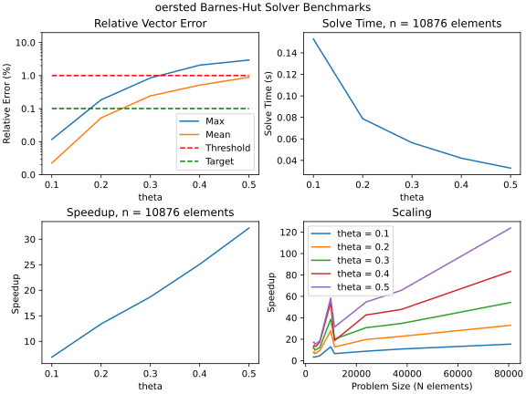
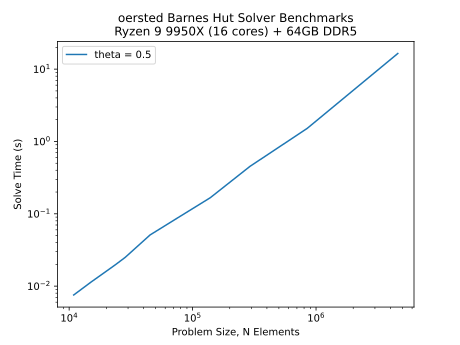

# `oersted`

Lightning-fast magnetic fields calculations

[Documentation](https://retkins.github.io/oersted) | [Rust API](https://docs.rs/oersted/latest/oersted/)

This library contains highly-optimised routines for solving magnetic fields calculations, using both analytic and approximate volume integral methods. Included is a Barnes-Hut solver with multipole expansion at octree nodes, which dramatically reduces solver speed at acceptable error levels:



The Barnes-Hut solver exhibits excellent scaling performance, solving a 4.6M 
element (21.2e12 interaction) problem in ~20 seconds on a consumer-grade workstation:



## Installation

`oersted` can be installed via `pypi`:
```bash
pip install oersted
```

or from `crates.io`:
```bash
cargo add oersted
```

## Example
```python
import oersted 

# Mesh the part 
mesh_size = 10e-3 # (m)
mesh = oersted.Mesh.from_step("my_part.stp", mesh_size)

# Compute the current density on the part 
jdensity: NDArray[float64] = ... 

# Compute self-fields using the 'fast' solver
settings = oersted.SolverSettings(method="octree", theta=0.5)
B = oersted.b_field(mesh, mesh.centroids, jdensity=jdensity, settings=settings)

# Compute forces from self-fields 
F = oersted.lorentz_forces(mesh, jdensity, B)
```

## Features

This library provides Barnes-Hut-accelerated volume integral methods for computing
magnetic fields generated by current-carrying solid conductors and magnetic materials:
* Methods for meshing STEP files (via [gmsh](https://gmsh.info)) 
* Analytic Biot-Savart integrals for current-carrying and magnetized tetrahedrons
* A 'point' fields source, which is orders of magnitude faster and highly accurate 
for far-field and force calculations
* Barnes-Hut/octree methods for reducing the time complexity of Biot-Savart law 
integration from `O(N^2)` to near-linear, allowing the solution of multi-million element
models in seconds on a laptop
* A basic iterative solver for isotropic linear materials (`mu_r < 20.0`)
* Force calculations using the Maxwell stress tensor (surface-based), Kelvin, or Lorentz 
(volumetric) formulations

### Roadmap

This project is under active development and will be changing quite a bit on its way
to a stable 1.0.0 release:

- v0.1.0
    - [x] Octree acceleration for both analytic and point approximations of finite element sources
- v0.2.0
    - [x] Dramatic simplification of the library and internal/external API's
    - [x] Tetrahedra meshing and force calculations
- v0.3.0
    - [x] Solid angle calculations to replace the edge-integral formulations for fields 
    from 3D elements (2-4x speed improvement)
- v0.4.0
    - [x] Convert octree methods from recursive to interaction lists (2-5x speed improvement)
    - [x] Refactor library for ease of use and maintainability
- v0.5.0 
    - [ ] GMRES solver for high-permeability materials
    - [ ] Eddy current solver for low-frequency time domain problems
- v0.6.0 
    - [ ] Symmetry boundary conditions
    - [ ] Multi-material meshes
    - [ ] BH curves for nonlinear magnetic materials
- v0.7.0
    - [ ] Steady-state conduction solver 
- v0.8.0 
    - [ ] Eddy current solver for frequency-domain problems 
- v0.9.0
    - [ ] 3D GUI (e.g. integrated with [ONELAB](https://onelab.info/))


## Background

The Biot-Savart Law is widely used to calculate the magnetic fields of electromagnets by summing the contributions of many small magnetic field sources at a large number of target points. This calculation, in its simplest form, has time complexity of `O(M x N)`, where `M` is the number of source points and `N` is the number of target points. 

### Barnes-Hut Algorithm
This code applies the [Barnes Hut algorithm](https://en.wikipedia.org/wiki/Barnes%E2%80%93Hut_simulation) for large-N interaction problems to achieve linear time complexity of the same calculation while maintaining reasonable (<1%) error relative to the full ("direct") calculation.  

This library uses an octree, which is a tree structure that divides the problem space recursively into 8 octants. Each octant hosts a collection of source points, which are summed together at each node. If the distance between the node and a target point is far enough away such that treating the many source points within the node as one large "super source", the node is 'accepted' and an approximate calculation is performed. If the node is too close, then it is recursively subdivided and the same acceptance criteria is applied again. In practice, an acceptance criteria of `phi = node_size/distance = 0.5` has been found to be effective for self-fields problems. 

See [https://jheer.github.io/barnes-hut/](https://jheer.github.io/barnes-hut/) for an excellent demo of the algorithm applied to gravitational problems. 

### Intended Problems

The intended problem for this code is a finite element mesh of a *solenoidal* collection of current-carrying 3D bodies. The magnetic field generated by these currents can either be computed on the bodies themselves (self-field) or at a collection of points not on the bodies. Each element is treated as a component of a finite sum approximation to the Biot Savart integral. 

Problem sizes typically solved on a workstation computer (i.e. finite element meshes of <10M elements) are considered for testing of this code. 

## Contributing

Please [contact](mailto:retkins@pm.me) the author prior to making a pull request.

## License
[MIT](LICENSE-MIT) or [Apache 2.0](LICENSE-APACHE), at your option.