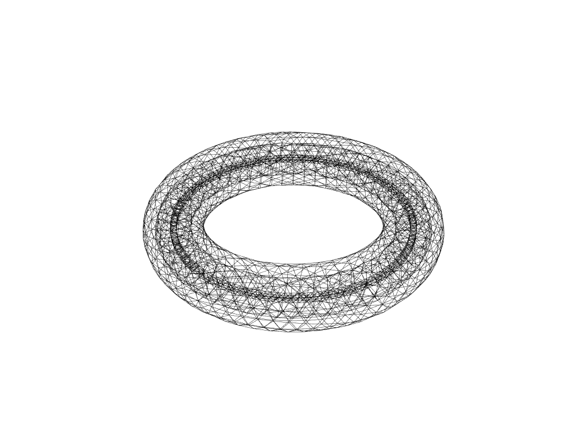
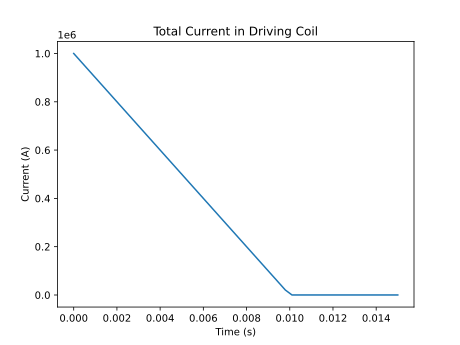
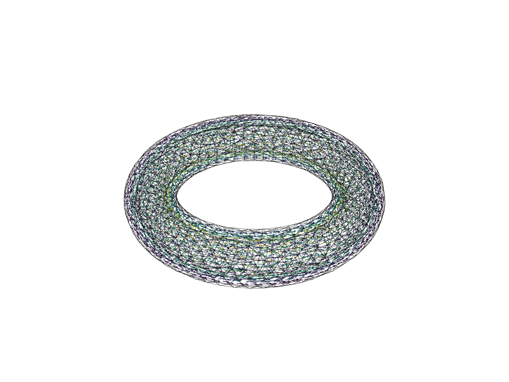
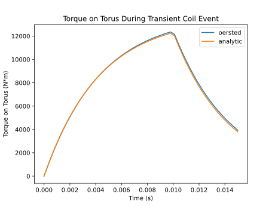

# Example - Eddy Currents in a Thin-Walled Torus 

This example demonstrates the following features of `oersted`:

* The time-domain eddy current solver and computing resultant forces on a 3D volume
* Computing eddy currents on a geometry with complex homology, without the need for a
separate cohomology evaluation

## Problem Statement 

A conducting thin-walled torus is suspended in a 1 T background field. A circular loop
coil is present inside the torus, carrying a current of 100 kA. Over a time period of 
10ms, the current in the coil decays, driving eddy currents in the torus. Find the 
torque acting on the torus due to the interaction between the induced eddy currents and
the background field.

* $ \rho= 1.0 \cdot 10^{-7} \\space \Omega \cdot m $
* Torus major and minor radii: $ R = 100 \space mm, a = 20 \space mm $
* Torus wall thickness: $ t = 10 \space mm $
* Cross-field: $ B_x = 1 \space T $
* Coil current and decay time: $ I_0 = 100 \space kA, t_{ramp} = 10 \space ms $ 
* Both the torus and the ring coil are aligned with the z-axis

## Create Geometry 

The `testing` module in oersted provides simple means of accessing the `gmsh` API to 
create geometry primitives. 

Torus: 

```python
major_radius = 0.10 # (m) 
minor_radius = 0.02 # (m) 
wall_thickness = 0.01 # (m) 
mesh_size = 0.01 # (m)

torus: Mesh = oersted.testing.make_torus(
    major_radius, minor_radius, wall_thickness, mesh_size
)
```

Ring coil: 

```python 
initial_current = 1e5 # (A) 
z_height = 0.0 
width = 0.005 # (m) cross-section
height = 0.005 # (m) 
ring_jmag = initial_current / (width * height) # (A/m^2) 
mesh_size = width
ring, ring_jdensity = oersted.testing.make_ring(
    major_radius, z_height, width, height, mesh_size, jmag=ring_jmag
)
```

Plot both meshes:

```python
mesh = torus.append(ring) 
oersted.mesh.plot(mesh, transparency=True)
```
#

## Compute Driven Coil Excitations

The transient solver in `oersted` attempts to be completely agnostic of how the external
changing fields are generated. To do this, it assumes that the *driven* coils are 
unaffected by the *passive* components. This way, external changing fields can be 
generated any way the user needs. 

In this example, the external fields are easy to compute; simply create a linear ramp
in time, then scale the fields generated by the ring at maximum current:

```python
# Time properties: linear decay to zero in 10ms, then watch the eddy currents decay
nt = 50
t_end = 0.015  # (s)
t_ramp = 0.010  # (s)
time = np.linspace(0, t_end, nt)
scale = np.maximum(1.0 - time / t_ramp, 0.0)

# Compute external fields acting on the torus (from the ring coil) over time
a_ext = np.zeros((nt, torus.num_elems, 3))
b_ext = np.zeros((nt, torus.num_elems, 3))

# A and B fields at maximum coil current, using the ring and its elemental current
# density at maximum current as the source
a_unit = oersted.a_field(ring, torus.centroids, jdensity=ring_jdensity)
b_unit = oersted.b_field(ring, torus.centroids, jdensity=ring_jdensity)

# Scale the fields to produce a simple linear decay over time
a_ext = scale[:, None, None] * a_unit
b_ext = scale[:, None, None] * b_unit
```

#

## Solve and Compute Torque 

The eddy current solver (in its present form) assumes that the mesh is continuous and 
is made of the same material (this will change in future releases). Therefore, running
the solution is as simple as passing the mesh information, the resistivity of the 
material, the time properties, and the external fields:

```python
results = oersted.transient_solve(torus, rho, nt, t_end, a_ext, b_ext)
```

Eddy currents in the torus at the end of the coil ramp:


Compute torque about centroid of torus, which is the origin:
```python
# f = j x b 
f = np.cross(results.j, cross_field) * torus.volumes[None, :, None]

# T = sum(r x f)
torque = np.sum(np.cross(torus.centroids[None, :, :], f), axis=1)
```

Torque can also be estimated by considering an L/R circuit of the same system, which
shows good agreement against the `oersted` solution:



