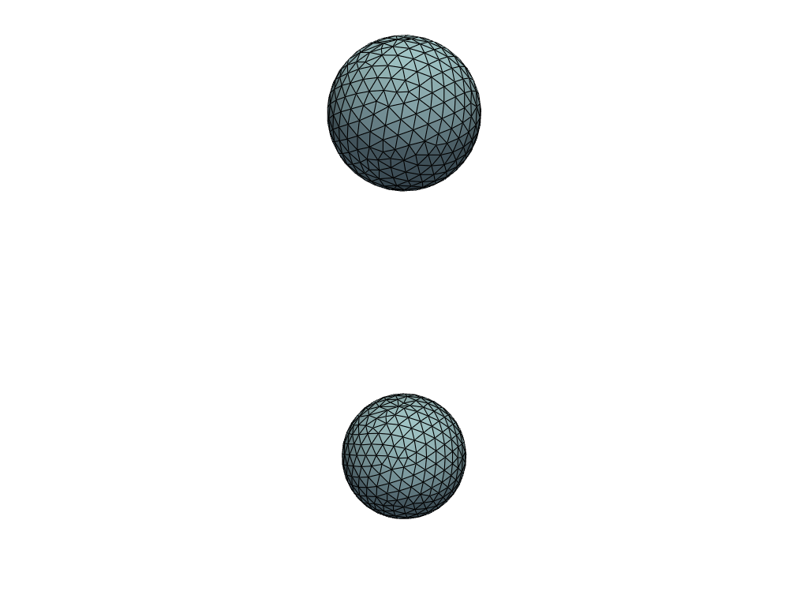
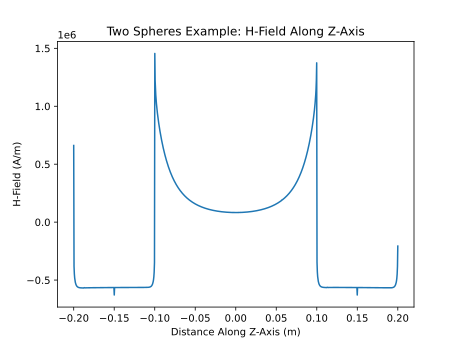

# Example - Two Magnetized Spheres

This example showcases: 

* Applying magnetic fields directly to simulate theoretical conditions
* Using the magnetization solver to compute the response of a linear material 
to an external field 
* Computing forces between magnetized objects and matching them to an analytical
solution

## Problem Statement

Two spheres are suspended in a $ 5 T $ background field

* Each has radius $ R = 100mm $ 
* The spheres are separated by a distance of $ d = 300 mm $ 
* The sphere material has a relative permeability of $ \mu_r = 2.5 $ 

## Mesh the Spheres

Load the geometry from STEP files: 

```python
import oersted, numpy as np 
from oersted import Mesh, MU0

mesh_size: float = 10.0e-3 # (m)
distance: float = 0.3 # (m)
upper_sphere = Mesh.from_step("sphere.stp", mesh_size)
upper_sphere.nodes[:,2] += distance/2.0
lower_sphere = Mesh.from_step("sphere.stp", mesh_size)
lower_sphere.nodes[:,2] -= distance/2.0

combined_mesh = upper_sphere.append(lower_sphere)
combined_mesh.plot()
``` 



## Background Field 

Apply a constant background field to both of the spheres:

```python
b_background: float = 5 # (T)

# We differentiate between 'background' and 'external' field
# Within the spheres, there will be multiple sources of H field
h_external: float = np.zeros(combined_mesh.centroids.shape)
h_external[:,2] = b_background / MU0
```

## Solve

Assign a material, select solution options, and solve the problem: 

```python
mu_r: float = 2.5
material = oersted.LinearMaterial(mu_r)

# Tolerance is on H-field, not B-field, so this is actually something
# like 1e-6 T
# The relaxation factor helps with convergence and is necessary for mu_r > 2.0
solver = oersted.DirectSolver(tol=1e0, alpha=0.5)

# We solve for the magnetization and the total internal H field in the spheres, 
# but we only need the magnetization
# B = mu0 * (M + H)
M, _ = oersted.demag_solve(combined_mesh, material, h_external, solver)
```

## Compute the Interaction Forces Acting Betwee the Spheres

This problem has an [analytical solution](https://en.wikipedia.org/wiki/Force_between_magnets#Magnetic_dipole-dipole_interaction) we can use to approximate the problem as an interaction between two perfect dipoles:

$$ M = 3 \space \frac{\mu_r - 1}{\mu_r + 2} \frac{B_{ext}}{\mu_0} = 3.98e6 \space A/m$$

$$ m = M \cdot V = M \cdot \frac{4}{3} \pi R^3 = 2083 \space A \cdot m^2 $$

$$ F = \frac{3 \mu_0 \cdot m^2}{2 \pi \cdot d^4} = 322 \space N $$

*(equal and opposite between the two spheres)*

```python
# Select only the magnetization field in the appropriate sphere
M_lower = M[: lower_sphere.num_elems]
M_upper = M[lower_sphere.num_elems :]

# Compute the total field acting on the nodes of both spheres,
# using only the other sphere as a source
h_field_nodes_upper = oersted.h_mag(
    lower_sphere, M_lower, upper_sphere.nodes, solver=solver
)
h_field_nodes_lower = oersted.h_mag(
    upper_sphere, M_upper, lower_sphere.nodes, solver=solver
)
h_field_nodes_upper[:, 2] += b_external_magnitude / MU0
h_field_nodes_lower[:, 2] += b_external_magnitude / MU0

# Compute the forces acting on each sphere
forces_upper = oersted.kelvin_forces(upper_sphere, M_upper, MU0 * h_field_nodes_upper)
forces_lower = oersted.kelvin_forces(lower_sphere, M_lower, MU0 * h_field_nodes_lower)

# Sum the forces and output
force_upper = np.sum(forces_upper, axis=0)
force_lower = np.sum(forces_lower, axis=0)
```

Which produces an output like this: 
```
Force on upper sphere:         ( 0.0, 0.0,-314.7) N 
Force on lower sphere:         (-0.3,-0.1, 314.7) N
```

## Fields 

We can plot the fields along an axis intersecting both spheres, to show how the 
magnetization primarily acts on the surface:



The upper sphere spans the space from z = [0.1,0.2] m, and the lower sphere spans the 
space from z = [-0.1, -0.2] m.