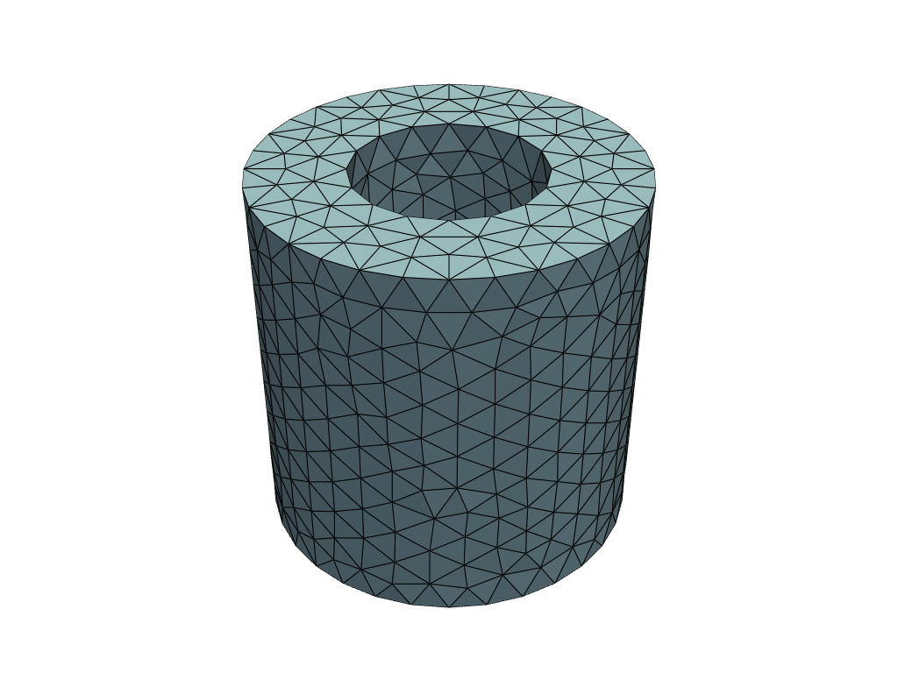
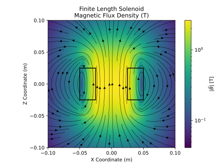
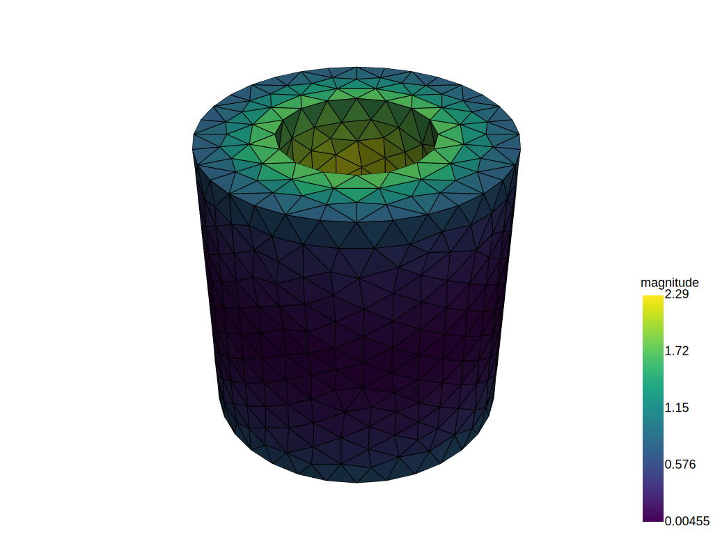

# Getting Started 

## Installation

`oersted` is typically used via the Python interface. This can be installed into your Python environment via `pip`:
```bash
pip install oersted
```

`oersted` is meant to be used as a standalone solver. However, if meshing and visualization capabilities are needed, it is recommended to install with the optional dependencies:
```bash
pip install oersted[mesh]
```

These optional capabilities are used throughout this tutorial.

`oersted` can also be used as a Rust library: 
```bash
cargo add oersted
```

## Basic Usage

`oersted` calculates magnetic fields at arbitrary points in space, using finite element meshes as sources. Typically, the mesh will be derived from an electric conduction analysis, so each element will have a current density vector associated with it. 

`oersted` also includes a basic interface to the [gmsh](https://gmsh.info/) Python API to mesh parts directly:

```python
import oersted

mesh_size: float = 0.010    # (m)
mesh = oersted.Mesh.from_step("solenoid-short.stp", mesh_size)
```

The mesh can be visualized:
```python
mesh.plot()
```

which produces a plot like this: 


Let's say we had a uniform circumferential current running along the windings of our solenoid, and wanted to visualize the magnetic field around it. We already have a discretized model of the solenoid geometry (the mesh), and now we need the electrical currents and the output points for the solver. 

First, create the current density in the windings:

```python
import numpy as np 

j_density_magnitude = 1e8 # (A/m2)

# We're creating an (N,3) array of the 
# current density vector (Jx, Jy, Jz) at each element
j_density = np.zeros((mesh.num_elems, 3))
phi = np.atan2(helmholtz_mesh.centroids[:, 1], helmholtz_mesh.centroids[:, 0])
j_density[:, 0] = -j_density_magnitude * np.sin(phi)
j_density[:, 1] = j_density_magnitude * np.cos(phi)
```

Then, create the output points:
```python
x = np.linspace(-0.1, 0.1, 100) 
z = np.linspace(-0.5, 0.5, 100) 
X, Z = np.meshgrid(x,z)
n = X.shape[0]

# This is another (N,3) array of the output point (x,y,z) coordinates
targets = np.vstack(X, np.array(n, 0.0), Z).T
```

Solve using the "fast" solver, which uses exact tetrahedral integration for near field and a "point" approximation for far-field:
```python
solver = oersted.OctreeSolver()
b = oersted.b_field(mesh, j_density, targets, solver=solver)
```

The fields in the solenoid look like this:
  
*(the plotting code is a bit lengthy, so it is excluded here)*

and in 3D:
```python
b = oersted.b_field(mesh, j_density, mesh.centroids, solver=solver)
bmag = np.linalg.norm(b, axis=1)
oersted.plot_mesh(
    mesh, 
    filename = "solenoid-fields-3d.svg", 
    scalars=bmag, 
    centroids=mesh.centroids, 
    vectors=b
)
```
