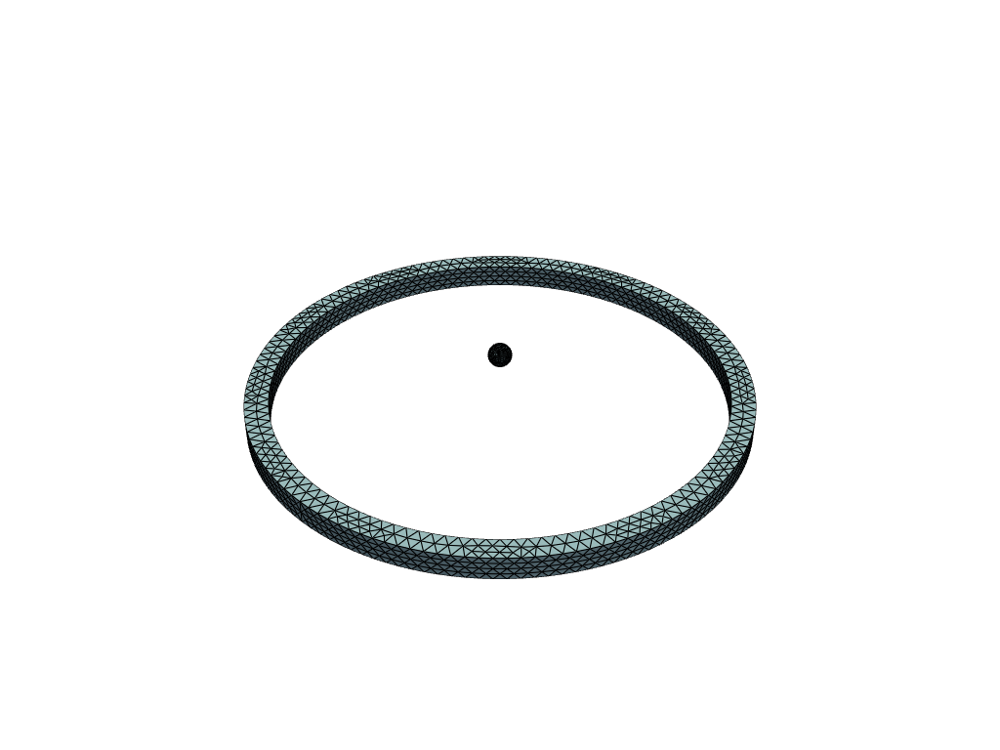
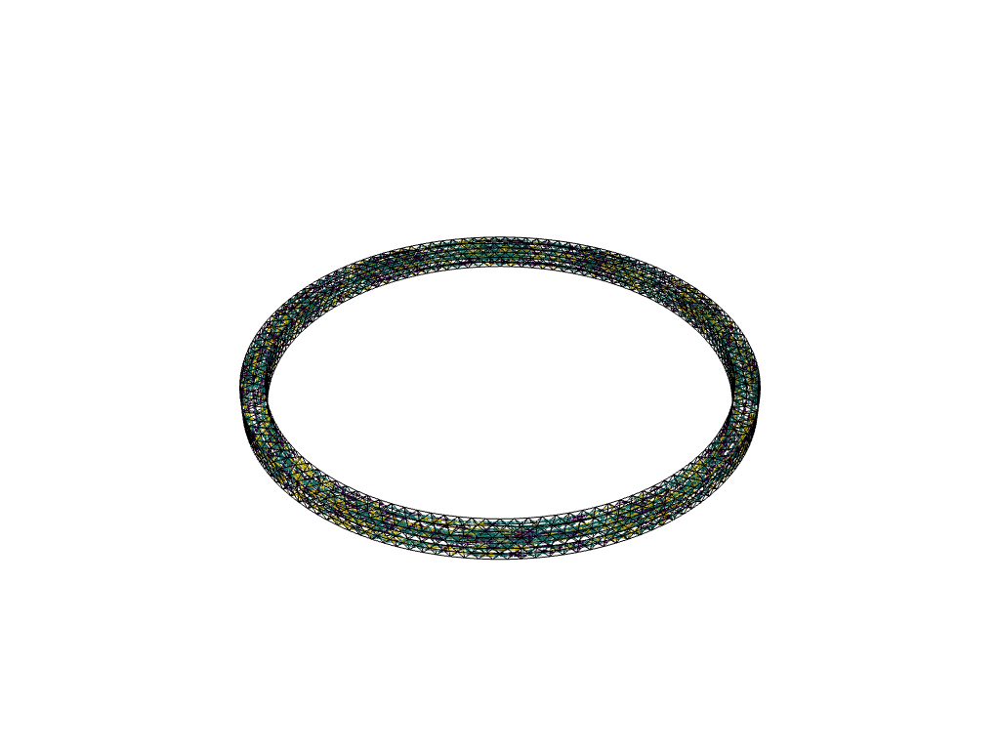
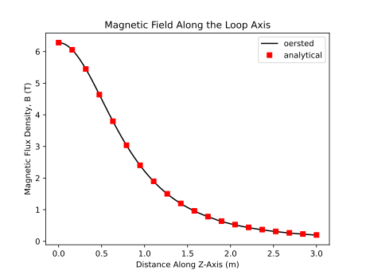
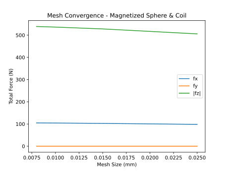

# Example - Force on a Magnetized Sphere

This example showcases:  

- Computing magnetic fields using a current-carrying finite element mesh as the source  
- Determining magnetization ($M$) field of a 3D object with linear magnetic
material properties  
- Calculating the force acting on the magnetic body due to the fields generated
by the current-carrying mesh  

## Problem Parameters 

A loop magnet:  

- Radius $R = 1.0 m$, centered at the origin  
- Square cross-section $h = 0.1 m$  
- Total current of $I = 10e6 A$ (amp-turns)  

*(Wow, that's a lot of current! Keeps 
fields in nice whole numbers...)*

A magnetic sphere:  

- Diameter of $d = 0.1 m$  
- Centered on the z-axis, with height $z = 0.2 m$  
- Relative permeability of $\mu_r = 1.5$ (mildly magnetic)  

## Geometry and Mesh

Load the geometry from step files:  
```python
import oersted 
import numpy as np 

loop_mesh_size: float = 50e-3 # (m)
loop_mesh = oersted.Mesh.from_step("loop_magnet.stp", loop_mesh_size)

sphere_mesh_size: float = 15e-3 # (m)
sphere_mesh = oersted.Mesh.from_step("sphere.stp", sphere_mesh_size) 
sphere_mesh.nodes[:,2] += 0.2 # (m), move up from (0, 0, 0)
```

Visualize the meshes together:
```python
# This creates a new mesh, which is not used later
loop_mesh.append(sphere_mesh).plot("meshes.svg")
``` 

  

## Loads

The loop has a current flowing through it, which means we need to calculate the 
associated current density. This is simply an `(Ne, 3)` array of vectors, where `Ne` 
is the number of elements in the loop magnet mesh: 
```python
area: float = 0.01  # (m^2)
j_density: NDArray[float64] = np.zeros(loop_mesh.centroids.shape)
jmag: float = current / area
phi: NDArray[float64] = np.atan2(
    loop_mesh.centroids[:, 1], 
    loop_mesh.centroids[:, 0]
)
j_density[:, 0] = -jmag * np.sin(phi)
j_density[:, 1] = jmag * np.cos(phi)
```

To visualize:  
```python
oersted.plot_mesh(
    loop_mesh,
    centroids = loop_mesh.centroids,
    vectors=j_density,
    vector_scale = 5.0e-2,
    transparency=True
)
```

(admittedly a bit difficult to see with this particular form factor)


## Fields Calculations

The magnetic field generated by a current-carrying loop has a well-understood 
analytical expression (see Ref [4](references.md)), particularly at the centerline of
the loop: 
$$ B_z(z) = \frac{\mu_0 \cdot I \cdot r^2}{2 \space (z^2 + r^2)^{1.5}} $$ 

We can compute the magnetic field along the axis using the loop magnet's mesh, 
and compare it against the analytical solution: 
```python
n_pts: int = 100
axis_pts = np.zeros((n_pts, 3))
axis_pts[:,2] = np.linspace(0.0, 3.0, n_pts)
bz_axis = oersted.b_field(loop_mesh, j_density, axis_pts, solver=solver)
```

. 

Now to calculate the background magnetic fields generated by the loop, acting on
the sphere, as well as the magnetization of the sphere:
```python
# Compute the external field acting on the sphere
bext = oersted.b_field(loop_mesh, j_density, mesh.centroids, solver=solver)

# Solve for the magnetization of the sphere and demagnetization field
M, H = oersted.demag_solve(mesh, material, bext / oersted.MU0, solver)
```

## Force Calculation

Now that we've determined the fields within the sphere, we can solve for the force 
acting on it. To check the result from `oersted`, use an analytical approximation: 

- The internal magnetization field is aligned with the background field   
- The sphere acts like a perfect dipole, with associate magnetic moment $\vec{m}=\vec{M}\cdot V $  
- Since the sphere is symmetric on the z-axis of the loop, we assume the forces
acting on it in the x- and y-directions are perfectly balanced, so there's only 
net force in the z-direction.  
- The net force in the z-direction is pulling it towards the plane of the loop (downwards)  

We use the expression for Kelvin force:  
$$ F = (m\cdot\nabla)B $$

The background magnetic field at $z = 0.2 m$ is $B_z = 5.924 T$. The magnetization 
of a sphere in a *uniform* background field has an analytical solution; for this 
demo we'll assume that the field is uniform:  

$$\chi = \frac{3 \cdot (\mu_r - 1)}{\mu_r + 2.0}  = 0.429$$

$$M = \chi \cdot \frac{B_z}{\mu_0} = 2.02e6 A/m $$

$$ V = \frac{4}{3} \pi r^3 $$ 

$$ m = M \cdot V = 1058 A\cdot m^2 $$  

Differentiating the analytical expression for the field gradient at z=0.2m:  
$$ \partial B_z / \partial z = -3.418 T/m $$

Therefore, we expect approximatately:  
$$ F = m \cdot \partial B_z / \partial z = -3616 N $$

Computing this value in `oersted` requires a handful of steps: 
```python
# Compute the background field on the nodes for the Kelvin force evaluation
b_field_nodes = oersted.b_field(loop_mesh, j_density, mesh.nodes, solver=solver)

# Use the magnetization at the centroids and the B-field at the nodes to compute
# the Kelvin forces acting on the centroids
forces = oersted.kelvin_forces(mesh, M, b_field_nodes)

total_force = np.sum(forces, axis=0)
```


